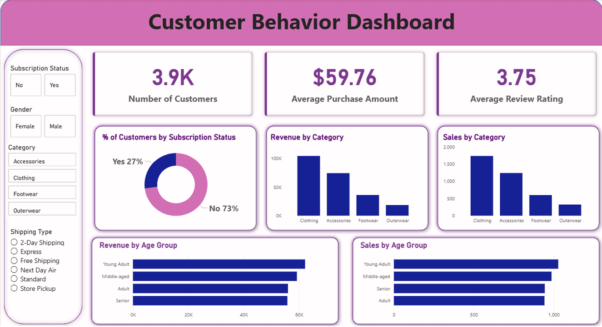

# 👨🏻‍💻 Customer Behavior Data Analyst Portfolio Project

This project represents a complete, industry-standard, end-to-end data analytics workflow, designed to mirror the real responsibilities of professional analysts in modern business environments. The project encompasses all critical stages of data analysis, from data preparation and modeling to insight generation, visualization, and reporting.

This project is perfect for:
- 📊 Data Analyst aspirants who want to build a strong **Portfolio Project** for interviews and LinkedIn
- 📚 Anyone learning Python, SQL, and Power BI
- 💼 Professionals preparing for interviews in Data Analytics, Data Science or Product Analytics roles

## 📌 Project Overview

The goal of this project is to simulate a corporate-grade end-to-end data analytics workflow, demonstrating the ability to translate raw data into strategic business intelligence by:

✅ **Data Preparation, Modeling & Exploratory Data Analysis (Python):** Clean and transform the raw dataset for analysis.

✅ **Data Analysis (SQL):** Simulate business transactions, and run queries to extract insights on customer segments, loyalty, and purchase drivers.

✅ **Visualization & Insights (Power BI):** Build an interactive dashboard that highlights key patterns and trends, enabling stakeholders to make data-driven decisions.

✅ **Report and Presentation:** Write a clear project report summarizing key findings and business recommendations. Prepare a presentation that visually communicates insights and actionable recommendations to stakeholders.

## ❓ Business Questions Answered

During the SQL data analysis phase, the following key business questions were explored:

1. **What is the total revenue generated by male vs. female customers?**
2. **Which customers used a discount but still spent more than the average purchase amount?**
3. **Which are the top 5 products with the highest average review rating?**
4. **Compare the average Purchase Amounts between Standard and Express Shipping.**
5. **Do subscribed customers spend more? Compare average spend and total revenue between subscribers and non-subscribers.**
6. **Which 5 products have the highest percentage of purchases with discounts applied?**
7. **Segment customers into New, Returning, and Loyal based on their total number of previous purchases, and show the count of each segment.**
8. **What are the top 3 most purchased products within each category?**
9. **Are customers who are repeat buyers (more than 5 previous purchases) also likely to subscribe?**
10. **What is the revenue contribution of each age group?**

## 💡 Key Insights Found

Based on the data analysis, here are some of the strategic insights discovered:

- **Revenue Demographics:** Identified which gender and age groups contribute the most to the total revenue, allowing for more targeted marketing campaigns.
- **Subscription Value:** Subscribed customers generally exhibit higher average spend and contribute more significantly to total revenue compared to non-subscribers.
- **Discount Impact:** Discounts are effective; we identified specific customers who utilized discounts yet still managed to spend more than the store-wide average.
- **Customer Segmentation:** Successfully segmented the customer base into *New*, *Returning*, and *Loyal* customers based on previous purchase counts, providing a clear roadmap for retention strategies.
- **Product Performance:** Uncovered the top-rated products and the most popular products within each category, highlighting the strongest items in the inventory.
- **Shipping Preferences:** Analyzed the relationship between shipping methods (Standard vs. Express) and average purchase amounts, revealing customer urgency and willingness to pay.

## 📊 Power BI Dashboard

Below is a snapshot of the Power BI dashboard created for this project:


*(Note: Please ensure the dashboard image file is placed in the repository as `dashboard.png`)*

## 🛠️ How to Use This Project

1. **Clone the repository**
   ```bash
   git clone https://github.com/ChiragAvasthi/Customer_trend_analysis.git
   cd Customer_trend_analysis
   ```
2. **Open `Customer_Shopping_Behavior_Analysis.ipynb` notebook**
   This file contains Data Import, Data exploration, Data cleaning, and Connection to SQL Database.
   
3. **Load the data into SQL Database**
   - Create a database in your preferred SQL server (MySQL/PostgreSQL/MS SQL Server).
   - Run the Python code to load data into the SQL database.
   - Open **`customer_behavior_sql_queries.sql`** to run the business questions and analyses.
      
4. **Connect the SQL Database to Power BI**
   - Open **`customer_behavior_dashboard.pbix`**
   - Interact with the dashboard and visualizations.

## 📜 License

MIT — feel free to fork, star, and use in your portfolio.

## 👨‍💻 About the Author

**Chirag Avasthi**
- [GitHub Profile](https://github.com/ChiragAvasthi)
- Repository: [Customer_trend_analysis](https://github.com/ChiragAvasthi/Customer_trend_analysis.git)
